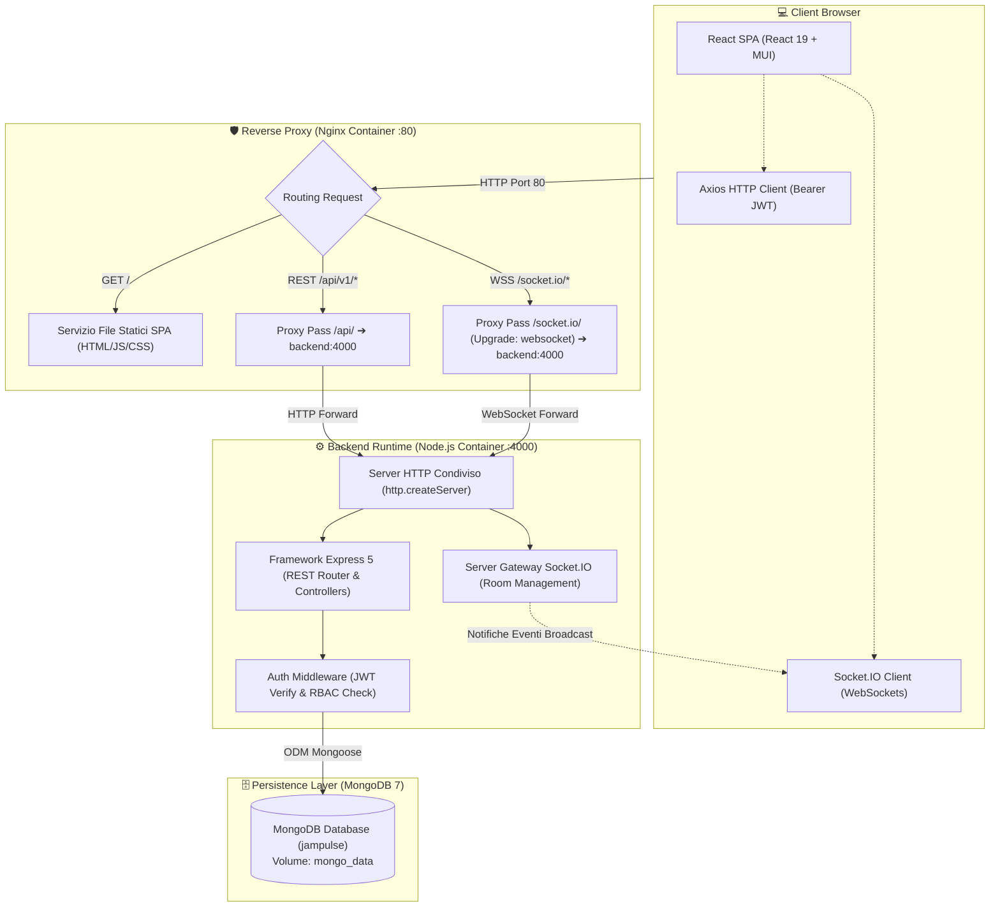
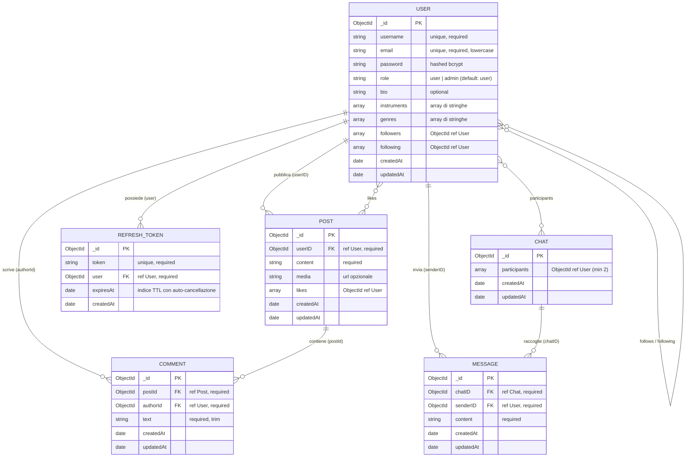
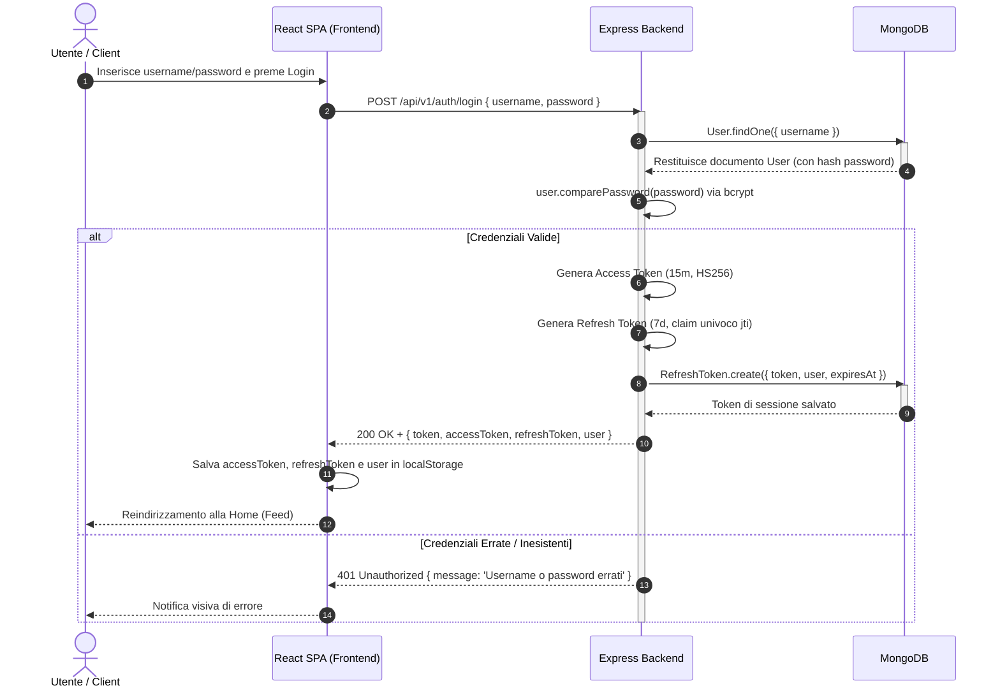
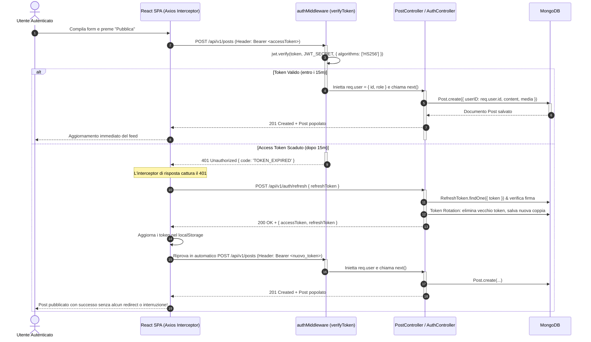
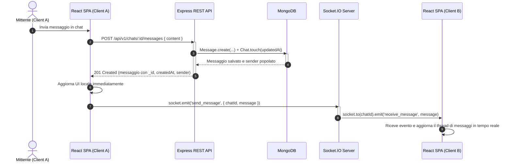

# 🎵 JamPulse — The Musicians' Social Network

<p align="center">
  
</p>

<p align="center">
  <strong>La piattaforma social e di networking dedicata ai musicisti: connettiti con altri artisti, condividi produzioni, scambia messaggi privati e partecipa a discussioni in tempo reale basate su affinità musicali, strumenti e generi condivisi.</strong>
</p>

<p align="center">
  
  
  
  
  
  
  
  
  
  
</p>

---

## 📋 Indice dei Contenuti

1. [Panoramica e Value Proposition](#-panoramica-e-value-proposition)
2. [Galleria Interfaccia Utente (UI Showcase)](#-galleria-interfaccia-utente-ui-showcase)
3. [Funzionalità Principali](#-funzionalità-principali)
4. [Architettura del Sistema e Network Flow](#-architettura-del-sistema-e-network-flow)
5. [Stack Tecnologico Dettagliato](#-stack-tecnologico-dettagliato)
6. [Modello Concettuale dei Dati & ER Diagram](#-modello-concettuale-dei-dati--er-diagram)
7. [Flussi Operativi e Diagrammi di Sequenza](#-flussi-operativi-e-diagrammi-di-sequenza)
8. [Architettura Real-Time con Socket.IO](#-architettura-real-time-con-socketio)
9. [Specifiche Complete API REST](#-specifiche-complete-api-rest)
10. [Sicurezza e Controllo Accessi (RBAC)](#-sicurezza-e-controllo-accessi-rbac)
11. [Struttura della Codebase](#-struttura-della-codebase)
12. [Guida all'Avvio Rapido con Docker](#-guida-allavvio-rapido-con-docker)
13. [Guida all'Avvio in Ambiente di Sviluppo](#-guida-allavvio-in-ambiente-di-sviluppo)
14. [Variabili d'Ambiente](#-variabili-dambiente)
15. [Database Seeding & Account Demo di Prova](#-database-seeding--account-demo-di-prova)
16. [Documentazione Interattiva Swagger & Health Check](#-documentazione-interattiva-swagger--health-check)
17. [Tassonomia Musicale Supportata](#-tassonomia-musicale-supportata)
18. [Roadmap & Evolutive Future](#-roadmap--evolutive-future)

---

## 🌟 Panoramica e Value Proposition

Trovare membri per completare una band, avviare collaborazioni per registrare nuovi brani o ricevere feedback qualificati sulle proprie melodie è spesso dispersivo sui social network generalisti.

**JamPulse** è un ecosistema full-stack progettato specificamente per le esigenze dei musicisti. Consente a ciascun artista di:
- **Esibire la propria identità musicale**: profilo arricchito con bio artistica, strumenti suonati e generi di riferimento.
- **Social Feed & Content Sharing**: pubblicazione di post con testo e link multimediali (immagini, demo, cover) con sistema di like interattivo.
- **Commenti e Discussioni Sincrone**: thread di discussione sotto i post con aggiornamento istantaneo real-time per chiunque stia visualizzando il medesimo brano/post.
- **Messaggistica Privata 1-to-1 Real-Time**: sistema di chat diretta istantanea con badge di presenza e notifiche immediate.
- **Ricerca Parametrica per Affinità**: motore di ricerca utenti basato su filtri combinati per strumento (es. Batteria, Basso) e genere (es. Jazz, Rock, Funk).
- **Ruoli e Moderazione (RBAC)**: distinzione tra normali utenti e amministratori abilitati alla moderazione dei contenuti e alla gestione degli account.
- **Adattabilità Visiva (Theme System)**: supporto completo per modalità Dark e Light gestito a livello globale tramite ThemeContext di React e Material UI.

---

## 📸 Galleria Interfaccia Utente (UI Showcase)

Di seguito una panoramica visiva delle schermate principali dell'applicazione:

| Feed Principale (Home) | Dettaglio Post & Commenti Live |
|:---:|:---:|
|  |  |
| *Feed cronologico globale, card post multimediali e toggle like* | *Dettaglio del post con sincronizzazione real-time dei commenti* |

| Chat Privata Real-Time | Ricerca Musicisti con Filtri |
|:---:|:---:|
|  |  |
| *Conversazioni 1-a-1 via WebSocket con storico persistito* | *Filtro multi-tag per strumenti suonati e generi musicali* |

| Profilo Utente & Competenze | Autenticazione & Registrazione |
|:---:|:---:|
|  |  |
| *Visualizzazione bio, badge strumenti, generi e storico post* | *Accesso sicuro con JWT e onboarding con preferenze musicali* |

---

## ⚡ Funzionalità Principali

| Modulo | Descrizione Operativa |
|---|---|
| **Autenticazione & Sessioni** | Architettura **Dual-Token**: Access Token a breve durata (15m) + Refresh Token a lunga durata (7d) persistito su MongoDB con indice TTL per eliminazione automatica. Silent Refresh trasparente gestito dall'interceptor di Axios con coda di richieste (`failedQueue`), rotazione crittografica dei token (Token Rotation con claim `jti`) e revoca su logout: l'utente naviga senza interruzioni e non viene mai disconnesso durante l'uso attivo. |
| **Controllo Accessi (RBAC)** | Distinzione tra ruolo `user` e `admin`. Gli amministratori possiedono badge visivi dedicati, possono moderare ed eliminare post e commenti altrui, eliminare account e promuovere/declassare ruoli. |
| **Feed & Gestione Post** | Creazione, modifica ed eliminazione di post con supporto a collegamenti multimediali; visualizzazione feed ordinato per data decrescente; sistema di Like/Unlike con contatore reattivo. |
| **Commenti Real-Time** | Aggiunta, modifica ed eliminazione commenti. Grazie all'architettura a stanze di Socket.IO, ogni utente con il dettaglio del post aperto visualizza i nuovi commenti all'istante senza ricaricare la pagina. |
| **Chat Privata Istantanea** | Conversazioni private 1-to-1 con storico messaggi. Ricezione e invio messaggi istantaneo tramite stanze Socket.IO dedicate (`chatId`). |
| **Social Graph (Follow/Unfollow)** | Possibilità di seguire e smettere di seguire altri artisti, aggiornando le metriche social del profilo e la lista degli utenti seguiti. |
| **Motore di Ricerca Parametrico** | Ricerca testuale per username combinabile con filtri multi-selezione a chip su 9 strumenti e 10 generi musicali. |
| **Theme Switcher** | Supporto Dark/Light mode globale tramite Material UI, con persistenza della palette visiva. |
| **OpenAPI / Swagger** | Documentazione interattiva integrata consultabile direttamente su `/api-docs`. |

---

## 🏛️ Architettura del Sistema e Network Flow

L'applicazione adotta un'architettura **Client-Server a 3 Livelli (3-Tier)** con disaccoppiamento completo tra frontend Single Page Application (SPA), backend API RESTful / WebSocket Gateway, e database persistente NoSQL.

### Diagramma di Flusso di Rete (Deployment in Container)



### Routing e Configurazione di Rete:
1. **Ambiente Docker**: L'utente si connette alla porta `80`. Nginx analizza il percorso:
   - Richieste statiche `/` $\rightarrow$ servite direttamente dalla cartella di build del frontend.
   - Prefisso `/api/` $\rightarrow$ inoltrate al container `backend:4000`.
   - Percorso `/socket.io/` $\rightarrow$ inoltrate al backend con upgrade dell'header a WebSocket (`Upgrade: websocket`).
2. **Ambiente di Sviluppo Locale**: Vite dev-server esegue sulla porta `5173` ed effettua il reverse-proxy automatico di `/api` e `/socket.io` verso `http://localhost:4000` (configurato in `frontend/vite.config.js`).

---

## 🛠️ Stack Tecnologico Dettagliato

### Backend
| Tecnologia | Versione | Motivazione & Ruolo Architetturale |
|---|---|---|
| **Node.js** | LTS (v20+) | Ambiente di runtime JavaScript asincrono ed event-driven a elevate prestazioni I/O. |
| **Express** | 5.2.x | Router HTTP modulare e middleware pipeline per la definizione delle rotte REST. |
| **MongoDB** | 7.0 | Database NoSQL documentale, ideale per schemi polimorfi e dati musicali annidati. |
| **Mongoose** | 9.9.x | ODM per la modellazione schemi, validazione dati, pre-save hook di hashing e population dei riferimenti. |
| **Socket.IO** | 4.8.x | Gateway bidirezionale basato su WebSocket con fallback automatico a HTTP long-polling per chat e commenti sincroni. |
| **jsonwebtoken** | 9.0.x | Generazione e verifica stateless dei token JWT con algoritmo vincolato `HS256`. |
| **bcryptjs** | 3.0.x | Funzione di hashing unidirezionale sicura con salt factor a 10 round per la protezione delle password. |
| **swagger-ui-express & swagger-jsdoc** | 5.x / 6.x | Generazione e visualizzazione interattiva della documentazione API secondo le specifiche OpenAPI 3.0. |
| **dotenv** | 17.4.x | Iniezione runtime delle variabili d'ambiente da file `.env`. |

### Frontend
| Tecnologia | Versione | Motivazione & Ruolo Architetturale |
|---|---|---|
| **React** | 19.2.x | Libreria UI dichiarativa a componenti reattivi per una SPA fluida. |
| **Vite** | 8.1.x | Next-generation build tool con Hot Module Replacement (HMR) istantaneo. |
| **Material UI (MUI)** | 9.2.x | Design system completo con componenti pre-costruiti e supporto a temi dinamici. |
| **React Router DOM** | 7.18.x | Routing dichiarativo lato client con gestione delle route protette (`ProtectedRoute`). |
| **Axios** | 1.19.x | Client HTTP con interceptor globali per l'iniezione automatica del token Bearer e auto-logout su HTTP 401. |
| **Socket.IO Client** | 4.8.x | Client WebSocket con gestione del ciclo di vita della connessione e delle stanze. |

### Containerizzazione & Infrastruttura
| Componente | Ruolo |
|---|---|
| **Docker Engine & Compose v3.9** | Orchestrazione multi-container isolata per MongoDB, Backend, Frontend e Nginx. |
| **Nginx (Alpine)** | Server Web ad alte prestazioni per servire il bundle React compilato e reverse proxy unificato verso il backend. |

---

## 🗃️ Modello Concettuale dei Dati & ER Diagram

Il database MongoDB `jampulse` è strutturato in 6 collezioni relazionate tramite `ObjectId` Mongoose:



### Logica di Protezione & Metodi Mongoose:
- **Pre-save Hook User**:
  ```javascript
  userSchema.pre("save", async function () {
      if (!this.isModified("password")) return;
      this.password = await bcrypt.hash(this.password, 10);
  });
  ```
- **Metodo d'Istanza User**:
  ```javascript
  userSchema.methods.comparePassword = async function (candidatePassword) {
      return await bcrypt.compare(candidatePassword, this.password);
  };
  ```

---

## 🔄 Flussi Operativi e Diagrammi di Sequenza

### 1. Autenticazione e Gestione Sessione Dual-Token



### 2. Creazione Post, Scadenza Access Token e Silent Refresh Trasparente



### 3. Flusso Real-Time Ibrido (REST Persistence + Socket.IO Broadcast)

Per garantire la massima integrità dei dati e la persistenza anche in caso di disconnessioni di rete, JamPulse adotta il pattern **REST-first**:



---

## ⚡ Architettura Real-Time con Socket.IO

Il server unificato HTTP di Node.js (`http.createServer(app)`) condivide le porte sia per le REST API che per il gateway WebSocket di Socket.IO.

### Gestione delle Stanze (Room Topology)

Il server organizza i client connessi in **stanze logiche isolate**:

```
                       ┌───────────────────────────────┐
                       │       Socket.IO Gateway       │
                       └───────────────┬───────────────┘
                                       │
            ┌──────────────────────────┴──────────────────────────┐
            ▼                                                     ▼
┌───────────────────────────────┐             ┌───────────────────────────────┐
│     Stanza Chat ("chatId")    │             │   Stanza Post ("post_postId") │
│  - Client 1 (Partecipante A)  │             │  - Client 1 (Lettore Post)    │
│  - Client 2 (Partecipante B)  │             │  - Client 3 (Altro Musicista) │
└───────────────────────────────┘             └───────────────────────────────┘
```

### Tabella degli Eventi WebSocket

| Nome Evento | Direzione | Payload | Scopo / Comportamento |
|---|---|---|---|
| `connection` | Client $\rightarrow$ Server | — | Apertura connessione WebSocket; log del `socket.id`. |
| `join_chat` | Client $\rightarrow$ Server | `chatId` | Aggiunge il socket alla stanza della chat specifica (`socket.join(chatId)`). |
| `leave_chat` | Client $\rightarrow$ Server | `chatId` | Rimuove il socket dalla stanza (`socket.leave(chatId)`). |
| `send_message` | Client $\rightarrow$ Server | `{ chatId, message }` | Inoltra il messaggio a tutti i membri della stanza escluso il mittente. |
| `receive_message` | Server $\rightarrow$ Client | `message` | Ricezione istantanea del messaggio salvato per aggiornare lo state locale. |
| `join_post` | Client $\rightarrow$ Server | `postId` | Aggiunge il client alla stanza `post_${postId}` per monitorare i commenti. |
| `leave_post` | Client $\rightarrow$ Server | `postId` | Rimuove il client dalla stanza `post_${postId}` allo smontaggio del componente. |
| `send_comment` | Client $\rightarrow$ Server | `{ postId, comment }` | Broadcast del nuovo commento a chiunque abbia il post aperto. |
| `receive_comment`| Server $\rightarrow$ Client | `comment` | Ricezione istantanea del commento per aggiungerlo alla lista. |
| `disconnect` | Client $\rightarrow$ Server | — | Pulizia automatica delle stanze e liberazione delle risorse. |

---

## 📡 Specifiche Complete API REST

Tutti gli endpoint applicativi (eccetto login, registrazione e health check) richiedono l'autenticazione tramite Header HTTP:
```http
Authorization: Bearer <token_jwt>
```

In caso di errore, il backend restituisce un payload JSON standardizzato:
```json
{
  "message": "Descrizione leggibile dell'errore",
  "code": "CODICE_ERRORE_OPZIONALE"
}
```

### 1. Autenticazione — `/api/v1/auth`
| Metodo | Endpoint | Accesso | Descrizione | Request Body | Risposte HTTP |
|---|---|---|---|---|---|
| `POST` | `/register` | Pubblico | Registra un nuovo musicista | `{ email, username, password, instruments?, genres? }` | `201` Created, `400` Dati mancanti/duplicati, `500` Errore Server |
| `POST` | `/login` | Pubblico | Autentica l'utente ed emette Dual-Token | `{ username, password }` | `200` OK + `{ token, accessToken, refreshToken, user }`, `401` Credenziali errate, `400` Campi vuoti |
| `POST` | `/refresh` | Pubblico | Rinnovo trasparente Access Token con Token Rotation | `{ refreshToken }` | `200` OK + `{ token, accessToken, refreshToken }`, `400` Token mancante, `401` Scaduto o revocato |
| `POST` | `/logout` | Pubblico / Autenticato | Revoca la sessione cancellando il Refresh Token dal DB | `{ refreshToken? }` | `200` OK + `{ message }`, `500` Errore Server |

### 2. Utenti & Social Graph — `/api/v1/users`
| Metodo | Endpoint | Accesso | Descrizione | Note e Risposte |
|---|---|---|---|---|
| `GET` | `/me` | Autenticato | Profilo dell'utente corrente | `200` OK con bio, strumenti, generi, followers, following. |
| `PUT` | `/me` | Autenticato | Aggiorna profilo personale | Body: `{ bio, instruments, genres }`. `200` OK. |
| `GET` | `/me/following` | Autenticato | Lista utenti seguiti (popolati) | `200` OK con array `[{ _id, username }]`. |
| `GET` | `/` | Autenticato | Elenco di tutti gli utenti | `200` OK (usato nel motore di ricerca). |
| `GET` | `/:id` | Autenticato | Profilo pubblico di un utente | `200` OK, `404` Utente non trovato, `400` ID non valido. |
| `GET` | `/:id/posts` | Autenticato | Post pubblicati da un utente | `200` OK (ordinamento cronologico decrescente). |
| `POST` | `/:id/follow` | Autenticato | Segui un altro utente | `200` OK, `400` Segui te stesso o già seguito. |
| `DELETE` | `/:id/follow` | Autenticato | Smetti di seguire un utente | `200` OK, `400` Non puoi smettere di seguire te stesso. |
| `DELETE` | `/:id` | **Admin Only** | Eliminazione definitiva utente | `200` OK, `403` Privilegi insufficienti, `400` Auto-eliminazione bloccata. |
| `PATCH` | `/:id/role` | **Admin Only** | Modifica ruolo (`user`/`admin`)| Body: `{ role }`. `200` OK, `403` Forbidden, `400` Ruolo non valido. |

### 3. Post & Like — `/api/v1/posts`
| Metodo | Endpoint | Accesso | Descrizione | Request / Note |
|---|---|---|---|---|
| `GET` | `/` | Autenticato | Feed completo globale | `200` OK con autore popolato (`userID`). |
| `POST` | `/` | Autenticato | Pubblicazione nuovo post | Body: `{ content, media? }`. `201` Created. |
| `GET` | `/:id` | Autenticato | Dettaglio singolo post | `200` OK, `404` Non trovato. |
| `PUT` | `/:id` | Autore Post | Modifica contenuto/media | Body: `{ content, media? }`. `200` OK, `403` Se non autore. |
| `DELETE` | `/:id` | Autore o **Admin** | Eliminazione post | `200` OK, `403` Non autorizzato. |
| `POST` | `/:id/like` | Autenticato | Toggle like/unlike | `200` OK + `{ message, liked: boolean }`. |

### 4. Commenti — `/api/v1/posts/:id/comments`
| Metodo | Endpoint | Accesso | Descrizione | Note |
|---|---|---|---|---|
| `GET` | `/` | Autenticato | Commenti del post | `200` OK (ordinamento cronologico crescente `createdAt: 1`). |
| `POST` | `/` | Autenticato | Scrittura nuovo commento | Body: `{ text }`. `201` Created con autore popolato. |
| `PUT` | `/:commentId` | Autore Commento | Modifica commento proprio | Body: `{ text }`. `200` OK, `403` Azione non autorizzata. |
| `DELETE` | `/:commentId` | Autore o **Admin** | Eliminazione commento | `200` OK, `403` Azione non autorizzata. |

### 5. Chat Private — `/api/v1/chats`
| Metodo | Endpoint | Accesso | Descrizione | Note |
|---|---|---|---|---|
| `GET` | `/` | Partecipante | Elenco chat dell'utente | `200` OK ordinate per data di aggiornamento decrescente. |
| `POST` | `/` | Autenticato | Crea o recupera chat 1-a-1 | Body: `{ targetUserId }`. `200` se già esistente, `201` se nuova. |
| `DELETE` | `/:id` | Partecipante | Elimina conversazione | `200` OK, `403` Non partecipante. |

### 6. Messaggi di Chat — `/api/v1/chats/:id/messages`
| Metodo | Endpoint | Accesso | Descrizione | Note |
|---|---|---|---|---|
| `GET` | `/` | Partecipante | Cronologia messaggi della chat | `200` OK (ordinamento cronologico crescente). |
| `POST` | `/` | Partecipante | Invia nuovo messaggio | Body: `{ content }`. `201` Created (aggiorna `updatedAt` della chat). |
| `PUT` | `/:messageId` | Mittente | Modifica testo messaggio | Body: `{ content }`. `200` OK, `403` Non autorizzato. |
| `DELETE` | `/:messageId` | Mittente | Elimina singolo messaggio | `200` OK, `403` Non autorizzato. |

### 7. Health Check — `/api/v1/health`
| Metodo | Endpoint | Accesso | Descrizione | Risposta |
|---|---|---|---|---|
| `GET` | `/` | Pubblico | Controllo liveness del server | `200` OK + `{ message: "Server is OK" }` |

---

## 🛡️ Sicurezza e Controllo Accessi (RBAC)

JamPulse integra controlli difensivi a più livelli:

1. **Protezione Crittografica delle Password**:
   - Algoritmo `bcryptjs` con fattore di costo a 10 round.
   - Nessuna password in chiaro viene memorizzata o restituita nelle risposte API (uso metodico di `.select('-password')` nelle query Mongoose).
2. **Architettura Dual-Token (Access Token + Refresh Token)**:
   - **Access Token (15 minuti)**: a vita breve, stateless, inviato nell'header `Authorization: Bearer <token>`. La breve durata minimizza la finestra di vulnerabilità in caso di intercettazione.
   - **Refresh Token (7 giorni)**: a vita più lunga, generato con claim crittografico univoco (`jti: crypto.randomUUID()`) per prevenire collisioni e salvato nel database MongoDB.
   - **Algoritmo Crittografico Forzato**: sia l'Access Token che il Refresh Token forzano esplicitamente l'algoritmo sicuro `{ algorithms: ['HS256'] }`, neutralizzando attacchi di tipo *None-algorithm*.
   - **Token Rotation (RFC 6749 / OAuth2 Best Practice)**: a ogni operazione di refresh, il vecchio Refresh Token viene immediatamente invalidato e rimpiazzato con uno nuovo. In questo modo ciascun token è rigorosamente monouso, bloccando attacchi di tipo *Replay Attack*.
   - **Indice TTL di MongoDB**: i token scaduti vengono eliminati fisicamente in automatico dal database grazie all'indice Time-To-Live (`expireAfterSeconds: 0`), senza richiedere cron job esterni.
   - **Revoca della Sessione al Logout**: l'endpoint `/api/v1/auth/logout` cancella il token dal DB, disabilitando istantaneamente la possibilità di ottenere nuovi token per quel dispositivo.
3. **Role-Based Access Control (RBAC)**:
   - Nel payload del JWT viene incluso il ruolo (`'user'` o `'admin'`).
   - Il middleware `requireRole('admin')` blocca accessi non autorizzati restituendo `403 Forbidden` (`FORBIDDEN`).
   - Gli amministratori possiedono speciali privilegi di moderazione (possono cancellare post e commenti ingiuriosi anche se non ne sono gli autori).
   - È presente un controllo che impedisce a un amministratore di declassare o eliminare per sbaglio il proprio account da endpoint dedicati.
4. **Protezione da Auto-Privilege Escalation**:
   - L'endpoint di registrazione (`authController.register`) impone server-side `role: 'user'`, ignorando qualsiasi tentativo malevolo di passare `"role": "admin"` nel body della richiesta.
5. **Silent Refresh Interceptor Trasparente con Coda Concorrente**:
   - L'interceptor globale di Axios (`frontend/src/axios.js`) rileva gli errori HTTP 401 (`TOKEN_EXPIRED`).
   - Gestisce la concorrenza tramite il **Request Queue Pattern**: se più componenti effettuano richieste parallele mentre il token scade, solo la prima effettua la chiamata a `/auth/refresh`, mentre le altre attendono nella `failedQueue`.
   - Ricevuto il nuovo token, tutte le richieste in sospeso vengono rieseguite in automatico: **l'utente naviga senza interruzioni e non viene mai buttato fuori durante l'uso attivo**.
   - Solo nel caso in cui anche il Refresh Token risulti scaduto (oltre 7 giorni di totale inattività) o revocato, la sessione viene azzerata con redirect a `/login`.

---

## 📂 Struttura della Codebase

```text
JamPulse/
├── backend/                               # Applicazione Server Node.js / Express
│   ├── controllers/                       # Business logic e gestione delle risorse
│   │   ├── authController.js              # Registrazione, login e firma JWT
│   │   ├── chatController.js              # Gestione conversazioni 1-a-1
│   │   ├── commentController.js           # CRUD commenti ai post
│   │   ├── healthController.js            # Endpoint liveness check
│   │   ├── messageController.js           # Gestione e cronologia messaggi di chat
│   │   ├── postController.js              # CRUD post e logica toggle like
│   │   └── userController.js              # Profili, follow, ricerca e moderazione admin
│   ├── middlewares/
│   │   └── authMiddleware.js              # Middleware JWT (verifyToken) e RBAC (requireRole)
│   ├── models/                            # Schemi Mongoose ODM e hook
│   │   ├── Chat.js                        # Schema conversazione (partecipanti)
│   │   ├── Comment.js                     # Schema commento collegato a Post e User
│   │   ├── Message.js                     # Schema messaggio (chatID, senderID, content)
│   │   ├── Post.js                        # Schema post (userID, content, media, likes)
│   │   ├── RefreshToken.js                # Schema refresh token con indice TTL automatico
│   │   └── User.js                        # Schema utente (role, bcrypt hook, followers)
│   ├── routes/                            # Mappatura endpoint RESTful
│   │   ├── authRoute.js
│   │   ├── chatRoute.js
│   │   ├── commentRoute.js
│   │   ├── healthRoute.js
│   │   ├── messageRoute.js
│   │   ├── postRoute.js
│   │   └── userRoute.js
│   ├── server.js                          # Bootstrap unificato: Express + Socket.IO + Mongoose
│   ├── swagger.js                         # Specifiche OpenAPI 3.0 JSDoc
│   ├── seed.js                            # Script di popolamento database con musicisti demo
│   ├── Dockerfile                         # Configurazione container backend
│   ├── package.json
│   └── .env.example                       # Template variabili d'ambiente
│
├── frontend/                              # Applicazione Client React SPA
│   ├── public/Logo/                       # Varianti logo responsive (Dark/Light)
│   ├── src/
│   │   ├── components/                    # Componenti UI riutilizzabili
│   │   │   ├── MessageBubble.jsx          # Bolla messaggio in chat con avatar e orario
│   │   │   ├── MultiSelectFilter.jsx      # Selettore a chip per strumenti e generi
│   │   │   ├── PageLayout.jsx             # Shell applicativa con Sidebar e Outlet
│   │   │   ├── PostCard.jsx               # Card post con gestione media, like e delete
│   │   │   ├── SearchBar.jsx              # Input con debounce per ricerca musicisti
│   │   │   ├── Sidebar.jsx                # Navigazione laterale e theme toggle
│   │   │   ├── UserBadge.jsx              # Badge identificativo utente con ruolo
│   │   │   └── UserCard.jsx               # Scheda musicista con pulsante follow/unfollow
│   │   ├── context/
│   │   │   ├── AuthContext.jsx            # Stato globale sessione, token e ruolo
│   │   │   └── ThemeContext.jsx           # Gestione tema Dark/Light via MUI
│   │   ├── hooks/
│   │   │   └── useSocket.js               # Custom hook per gestione eventi e stanze Socket.IO
│   │   ├── pages/                         # Viste applicative (React Router)
│   │   │   ├── Chat.jsx                   # Vista chat privata real-time
│   │   │   ├── CreatePost.jsx             # Form creazione nuovo post
│   │   │   ├── Home.jsx                   # Feed cronologico globale
│   │   │   ├── Login.jsx                  # Accesso e registrazione con filtri musicali
│   │   │   ├── PostDetail.jsx             # Dettaglio post con thread commenti sincroni
│   │   │   ├── Profile.jsx                # Profilo personale e di altri utenti
│   │   │   └── Search.jsx                 # Motore di ricerca con filtri avanzati
│   │   ├── services/                      # Client API Axios disaccoppiati per entità
│   │   ├── utils/
│   │   │   ├── musicOptions.js            # Costanti per strumenti e generi ammessi
│   │   │   └── timeUtils.js               # Formattazione timestamp date e orari
│   │   ├── App.jsx                        # Definizione albero rotte e ProtectedRoute
│   │   ├── axios.js                       # Configurazione globale Axios con Interceptors
│   │   └── main.jsx                       # Entry point DOM React 19
│   ├── Dockerfile                         # Build multistage con Nginx per produzione
│   ├── nginx.conf                         # Configurazione Nginx per SPA (try_files)
│   ├── vite.config.js                     # Configurazione Vite con proxy /api e /socket.io
│   └── package.json
│
├── nginx/
│   └── nginx.conf                         # Reverse proxy principale gateway di routing
├── UI/                                    # Screenshot dimostrativi dell'interfaccia
├── Documentazione - Esame/                # Diagrammi di sequenza e use-case originali
├── docker-compose.yml                     # Orchestrazione dei 4 container (mongo, backend, frontend, nginx)
└── README.md
```

---

## 🐳 Guida all'Avvio Rapido con Docker

L'approccio raccomandato per avviare l'intero stack in un ambiente identico alla produzione è l'uso di **Docker Compose**.

### Prerequisiti
- [Docker Desktop](https://www.docker.com/products/docker-desktop/) installato e attivo sulla macchina.

### Procedura di Avvio

1. **Clona il repository**:
   ```bash
   git clone https://github.com/tuo-username/JamPulse.git
   cd JamPulse
   ```

2. **Prepara il file delle variabili d'ambiente**:
   ```bash
   cp backend/.env.example backend/.env
   ```
   > 💡 Nel file `backend/.env`, per l'avvio con Docker assicurati che `MONGO_URI` sia impostato sul nome del servizio del database:
   > ```env
   > MONGO_URI=mongodb://mongo:27017/jampulse
   > CORS_ORIGIN=http://localhost
   > ```

3. **Avvia i container**:
   ```bash
   docker-compose up --build
   ```
   *(Aggiungi il flag `-d` per eseguire i container in background).*

4. **Accedi ai servizi**:
   - 🌐 **Frontend Web App**: [http://localhost](http://localhost)
   - 📖 **Swagger API Docs**: [http://localhost/api-docs](http://localhost/api-docs)
   - 🩺 **Health Check**: [http://localhost/api/v1/health](http://localhost/api/v1/health)

5. **Arresto dei container**:
   ```bash
   docker-compose down
   ```
   *(Per cancellare anche i dati persistiti nel volume MongoDB, aggiungi `-v`: `docker-compose down -v`).*

---

## 💻 Guida all'Avvio in Ambiente di Sviluppo

Se desideri eseguire il progetto in locale senza Docker per usufruire del reload a caldo sia su Express (`nodemon`) che su React (`Vite HMR`):

### Prerequisiti
- **Node.js** v18+ (consigliato v20 LTS o superiore)
- **MongoDB** in esecuzione in locale (porta standard `27017`)

---

### Passo 1: Configurazione ed Esecuzione del Backend

```bash
cd backend

# 1. Crea il file .env partendo dall'esempio
cp .env.example .env

# 2. Installa le dipendenze
npm install

# 3. (Opzionale ma consigliato) Popola il database con dati realistici
npm run seed

# 4. Avvia il server in modalità watch con nodemon
npm run dev
```

Il server Express e il gateway Socket.IO si avvieranno sulla porta specificata in `.env` (default: **4000**):
- API REST: `http://localhost:4000/api/v1`
- Swagger UI: `http://localhost:4000/api-docs`

---

### Passo 2: Configurazione ed Esecuzione del Frontend

In un secondo terminale:

```bash
cd frontend

# 1. Installa le dipendenze
npm install

# 2. Avvia il server di sviluppo Vite
npm run dev
```

L'applicazione sarà accessibile all'indirizzo:
- 🌐 **App Frontend**: [http://localhost:5173](http://localhost:5173)

> ℹ️ **Nota sul Proxy di Sviluppo**: Durante l'esecuzione con Vite, le chiamate a `/api` e le connessioni WebSocket su `/socket.io` vengono automaticamente inoltrate a `http://localhost:4000` grazie alla configurazione proxy presente in `vite.config.js`.

---

## ⚙️ Variabili d'Ambiente

Il file di configurazione `backend/.env` controlla i parametri operativi del server:

| Variabile | Obbligatoria | Valore Predefinito / Esempio | Descrizione |
|---|:---:|---|---|
| `PORT` | Sì | `4000` | Porta TCP su cui resta in ascolto il server Node.js HTTP/WebSocket. |
| `MONGO_URI` | Sì | `mongodb://localhost:27017/jampulse` | Stringa di connessione a MongoDB (locale o cluster remoto come MongoDB Atlas). In Docker usare `mongodb://mongo:27017/jampulse`. |
| `JWT_SECRET` | Sì | *stringa casuale complessa* | Chiave crittografica segreta per generare e verificare la firma dei token JWT (HS256). |
| `JWT_ACCESS_EXPIRES_IN` | No | `15m` | Tempo di validità dell'Access Token a breve durata (es. `15m`, `30m`, `1h`). |
| `REFRESH_TOKEN_SECRET` | No | *fallback su JWT_SECRET + _refresh* | Chiave crittografica dedicata alla firma dei Refresh Token. |
| `JWT_REFRESH_EXPIRES_IN` | No | `7d` | Tempo di validità del Refresh Token a lunga durata (es. `7d`, `30d`). |
| `CORS_ORIGIN` | No | `http://localhost:5173` | Origine HTTP autorizzata a effettuare chiamate cross-origin (`*` o indirizzo specifico). |
| `JWT_EXPIRES_IN` | No | `2h` | Parametro legacy di fallback per la scadenza dell'Access Token. |

---

## 🎸 Database Seeding & Account Demo di Prova

Il progetto include uno script di seeding (`backend/seed.js`) che pulisce il database e genera una rete musicale completa con artisti celebri, post con immagini multimediali, commenti incrociati e chat pre-avviate.

Per eseguire il popolamento:
```bash
# Eseguito all'interno della cartella backend/
npm run seed
```

### Account Pronti per il Test:

| Username | Email | Password | Ruolo | Strumenti | Generi Musicali |
|---|---|---|:---:|---|---|
| **`admin`** | `admin@jampulse.com` | `adminpassword123` | **`admin`** | Regia | All *(Accesso di moderazione)* |
| **`freddiemercury`** | `freddie@queen.com` | `password123` | `user` | Voce, Pianoforte | Rock, Pop |
| **`jimihendrix`** | `jimi@experience.com` | `password123` | `user` | Chitarra | Rock, Blues |
| **`milesdavis`** | `miles@cool.com` | `password123` | `user` | Tromba | Jazz |
| **`flea`** | `flea@rhcp.com` | `password123` | `user` | Basso | Funk, Rock |
| **`ludovico`** | `ludo@classica.com` | `password123` | `user` | Pianoforte | Classica |
| **`test`** | `test@test.com` | `test` | `user` | — | *(Utente neutro privo di interazioni)* |

> 🛡️ **Test della Moderazione Admin**: Effettuando il login con l'utente `admin`, noterai il badge rosso distintivo, la possibilità di rimuovere qualsiasi post o commento dalla UI (tramite il pulsante "Elimina (Admin)"), e l'accesso agli endpoint dedicati alla gestione degli utenti.

---

## 📖 Documentazione Interattiva Swagger & Health Check

JamPulse include una suite Swagger/OpenAPI 3.0 completamente navigabile che permette di esplorare gli schemi dati e testare ciascun endpoint direttamente dal browser:

- **Con Docker**: [http://localhost/api-docs](http://localhost/api-docs)
- **In Locale**: [http://localhost:4000/api-docs](http://localhost:4000/api-docs)

Per autorizzare le richieste da Swagger:
1. Effettua una chiamata a `POST /api/v1/auth/login`.
2. Copia la stringa `token` restituita.
3. Clicca sul pulsante verde **Authorize** in alto a destra su Swagger UI e incolla il token nel formato `Bearer <tuo_token>`.

### Endpoint di Health Check
Per sistemi di monitoraggio o container probe:
```http
GET /api/v1/health
```
Risposta:
```json
{
  "message": "Server is OK"
}
```

---

## 🎷 Tassonomia Musicale Supportata

Il frontend integra opzioni normalizzate in `src/utils/musicOptions.js` utilizzate sia in fase di registrazione sia nei filtri avanzati di ricerca:

### Strumenti Musicali:
`Arpa`, `Basso`, `Batteria`, `Chitarra`, `Pianoforte`, `Sassofono`, `Sintetizzatore`, `Tastiera`, `Voce`.

### Generi Musicali:
`Blues`, `Classica`, `Elettronica`, `Funk`, `Hip Hop`, `Indie`, `Jazz`, `Metal`, `Pop`, `Rock`.

---

## 🚀 Roadmap & Evolutive Future

- [ ] **WebRTC Jam Session**: implementazione di canali audio/video peer-to-peer per sessioni musicali e prove in streaming real-time a bassa latenza.
- [ ] **Player Audio Integrato**: supporto all'upload diretto di file audio/tracce (.mp3, .wav) con visualizzazione delle waveform ed integrazione con Spotify API / SoundCloud.
- [ ] **Sistema Notifiche Push**: introduzione di WebPush API per avvisare gli utenti di nuovi like, commenti, follow e messaggi anche con l'app in background.
- [ ] **Conversazioni di Gruppo**: estensione del modello `Chat` per supportare band e stanze di prova multi-utente.
- [ ] **Progressive Web App (PWA)**: abilitazione Service Worker per supporto offline e installazione nativa su dispositivi mobili Android/iOS.

---

## 📄 Licenza

Questo progetto è rilasciato sotto licenza [ISC](https://opensource.org/licenses/ISC).
